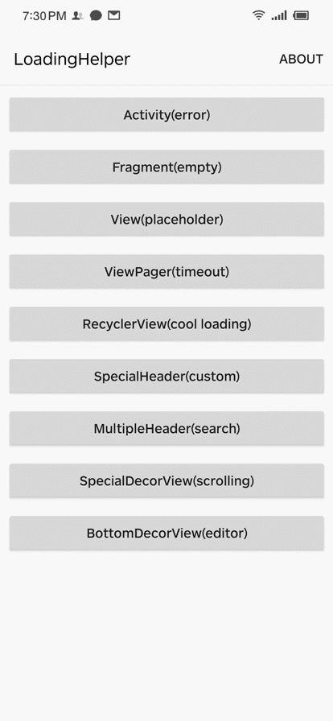
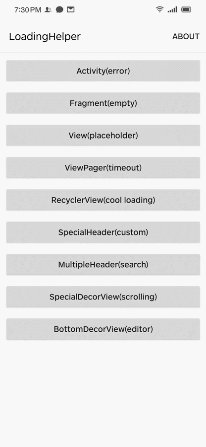

# LoadingStateView

[](https://www.jitpack.io/#DylanCaiCoding/LoadingLoadingStateView) 
[](https://github.com/DylanCaiCoding/LoadingStateView/blob/master/LICENSE)

`LoadingStateView` 是一个深度解耦加载界面和标题栏的工具，只用了一个 Kotlin 文件实现，不算上注释少于 300 行代码。不仅能在请求网络数据时**显示加载中、加载成功、加载失败、无数据的视图或自定义视图**，还可以**对标题栏进行管理**。

- 无需在布局添加视图代码
- 可显示自定义视图
- 可用于 Activity、Fragment、列表或指定的 View
- 可管理标题栏和添加多个头部控件
- 可设置重新请求数据的事件
- 可动态更新视图样式
- 可结合绝大部分第三方控件使用

## 示例

点击或者扫描二维码下载

[](https://www.pgyer.com/loadinghelper)

动态添加加载状态的布局：

| [Activity(error)](app/src/main/java/com/dylanc/loadingstateview/sample/ui/ActErrorActivity.java) | [View(placeholder)](app/src/main/java/com/dylanc/loadingstateview/sample/ui/ViewPlaceholderActivity.java) | [ViewPager(timeout)](app/src/main/java/com/dylanc/loadingstateview/sample/ui/ViewPagerActivity.java) | [RecyclerView(cool loading)](app/src/main/java/com/dylanc/loadingstateview/sample/ui/RecyclerViewActivity.java) |
| :----------------------------------------------------------: | :----------------------------------------------------------: | :----------------------------------------------------------: | :----------------------------------------------------------: |
|                                   |                                 |                                |                             |

动态添加标题栏或装饰容器：

| [SpecialHeader(custom)](app/src/main/java/com/dylanc/loadingstateview/sample/ui/CustomHeaderActivity.java) | [MultipleHeader(search)](app/src/main/java/com/dylanc/loadingstateview/sample/ui/MultipleHeaderActivity.java) | [SpecialDecorView(scrolling)](app/src/main/java/com/dylanc/loadingstateview/sample/ui/ScrollingToolbarActivity.java) | [BottomDecorView(editor)](app/src/main/java/com/dylanc/loadingstateview/sample/ui/BottomEditorActivity.java) |
| :----------------------------------------------------------: | :----------------------------------------------------------: | :----------------------------------------------------------: | :----------------------------------------------------------: |
|                            |                           |                          |                              |


## 开始使用

在根目录的 `build.gradle` 添加:

```groovy
allprojects {
    repositories {
        // ...
        maven { url 'https://www.jitpack.io' }
    }
}
```

在模块的 `build.gradle` 添加依赖：

```groovy
dependencies {
  implementation 'com.github.DylanCaiCoding:LoadingStateView:3.0.1'
}
```

### 基础用法

第一步，创建一个类继承  `LoadingStateView.ViewDelegate<VH extends ViewHolder>`，写法与 `RecyclerView.Adapter` 类似。如果需要实现点击重新请求数据，可以在点击事件调用 holder.getOnReloadListener.onReload() 方法。

```java
public class LoadingViewDelegate extends LoadingStateView.ViewDelegate<LoadingStateView.ViewHolder> {

  @NonNull
  @Override
  public LoadingStateView.ViewHolder onCreateViewHolder(@NonNull LayoutInflater inflater, @NonNull ViewGroup parent) {
    return new LoadingStateView.ViewHolder(inflater.inflate(R.layout.layout_loading_view, parent, false));
  }

  @Override
  public void onBindViewHolder(@NonNull LoadingStateView.ViewHolder holder) {
  }
}
```

第二步，注册 `ViewDelegate`，关联一个视图类型。有五个默认类型，也可以传任意类型数据进行注册。

```java
LoadingStateView loadingStateView = new LoadingStateView(this); // 可传 Activity 或 View
loadingStateView.register(ViewType.LOADING, new LoadingViewDelegate());
// 当需要支持点击重新请求数据时
loadingStateView.setOnReloadListener(() -> {})
```

如果需要注册成全局的 `ViewDelegate`。

```java
loadingStateView.setViewDelegatePool(pool -> {
  pool.register(ViewType.LOADING, new LoadingViewDelegate());
  return null;
});
```

第三步，显示对应类型的视图。

```java
loadingStateView.showView(viewType);
loadingStateView.showLoadingView(); // 对应视图类型 ViewType.LOADING
loadingStateView.showContentView(); // 对应视图类型 ViewType.CONTENT
loadingStateView.showErrorView(); // 对应视图类型 ViewType.ERROR
loadingStateView.showEmptyView(); // 对应视图类型 ViewType.EMPTY
```

**动态更新已显示视图**

在显示了视图之后，可以对视图进行更改刷新。和 `RecyclerView.Adapter` 类似，会执行适配器的 `onBindViewHolder()` 方法。

```java
loadingStateView.updateView(ViewType.ERROR, (ErrorViewDelegate delegate) -> {
   delegate.msg = "服务器繁忙，请稍后重试";
});
```

### 高级用法

#### 添加标题栏

如果是**普通的标题栏**，就是简单地在内容的上方添加标题栏：

和前面的用法类似，先创建一个继承  `LoadingStateView.ViewDelegate<VH extends ViewHolder>` 的标题栏适配器，然后就能在内容的上方添加标题栏了，可以添加多个头部。

```java
loadingStateView.setDecorHeader(new TitleViewDelegate("标题名"), new SearchHeaderViewDelegate());
```

如果是**特殊的标题栏**，比如有联动效果，就不能直接使用上面的方式了。这时我们要给内容增加个装饰的容器。

先实现一个不含内容的布局。

```xml
<?xml version="1.0" encoding="utf-8"?>
<androidx.coordinatorlayout.widget.CoordinatorLayout xmlns:android="http://schemas.android.com/apk/res/android"
  xmlns:app="http://schemas.android.com/apk/res-auto"
  android:layout_width="match_parent"
  android:layout_height="match_parent"
  android:fitsSystemWindows="true">

  <com.google.android.material.appbar.AppBarLayout
    android:id="@+id/app_bar"
    android:layout_width="match_parent"
    android:layout_height="@dimen/app_bar_height"
    android:fitsSystemWindows="true"
    android:theme="@style/AppTheme.AppBarOverlay">

    <com.google.android.material.appbar.CollapsingToolbarLayout
      android:id="@+id/toolbar_layout"
      android:layout_width="match_parent"
      android:layout_height="match_parent"
      android:fitsSystemWindows="true"
      app:contentScrim="?attr/colorPrimary"
      app:layout_scrollFlags="scroll|exitUntilCollapsed"
      app:toolbarId="@+id/toolbar">

      <androidx.appcompat.widget.Toolbar
        android:id="@+id/toolbar"
        android:layout_width="match_parent"
        android:layout_height="?attr/actionBarSize"
        app:layout_collapseMode="pin"
        app:popupTheme="@style/AppTheme.PopupOverlay" />
    </com.google.android.material.appbar.CollapsingToolbarLayout>
  </com.google.android.material.appbar.AppBarLayout>

  <FrameLayout
    android:id="@+id/content_parent"
    android:layout_width="match_parent"
    android:layout_height="match_parent"
    app:layout_behavior="@string/appbar_scrolling_view_behavior" />
</androidx.coordinatorlayout.widget.CoordinatorLayout>
```

创建一个类继承 `LoadingStateView.DecorViewDelegate` ，加载实现的布局，并指定一个添加内容的容器。

```java
class ScrollingDecorViewDelegate : LoadingStateView.DecorViewDelegate() {
  @NotNull
  override fun onCreateDecorView(@NotNull inflater: LayoutInflater): View {
    return inflater.inflate(R.layout.layout_scrolling, null)
  }

  @NotNull
  fun getContentParent(@NotNull decorView: View): ViewGroup {
    return decorView.findViewById(R.id.content_parent)
  }
}
```

最后设置一下就可以了。

```java
loadingStateView.setDecorView(new ScrollingDecorViewDelegate());
```

上述的两种使用方式都是可以进行多次设置，不过每次设置会把上一次设置的样式给替换掉。

## LoadingHelper 迁移指南

本库原名是 `LoadingHelper`，后面对部分类名和方法名进行修改。老用户可以查看[迁移指南](https://github.com/DylanCaiCoding/LoadingHelper/blob/main/README_CN.md)改为最新的用法，如果觉得麻烦并且不是强迫症患者，也可以不迁移。

## 作者其它的库

| 库                                                           | 简介                                           |
| ------------------------------------------------------------ | ---------------------------------------------- |
| [Longan](https://github.com/DylanCaiCoding/Longan)           | 可能是最好用的 Kotlin 工具库                  |
| [ViewBindingKTX](https://github.com/DylanCaiCoding/ViewBindingKTX) | 最全面的 ViewBinding 工具                      |
| [MMKV-KTX](https://github.com/DylanCaiCoding/MMKV-KTX)       | 用属性委托的方式使用 MMKV                              |

## 感谢

- [luckbilly/Gloading](https://github.com/luckybilly/Gloading) 站在了巨人肩膀上优化了本库，非常感谢！
- [drakeet/MultiType](https://github.com/drakeet/MultiType) 参考了注册配置多适配器的思想和用法
- [dinuscxj/LoadingDrawable](https://github.com/dinuscxj/LoadingDrawable) 示例中的自定义加载动画

## License

```
Copyright (C) 2019. Dylan Cai

Licensed under the Apache License, Version 2.0 (the "License");
you may not use this file except in compliance with the License.
You may obtain a copy of the License at

   http://www.apache.org/licenses/LICENSE-2.0

Unless required by applicable law or agreed to in writing, software
distributed under the License is distributed on an "AS IS" BASIS,
WITHOUT WARRANTIES OR CONDITIONS OF ANY KIND, either express or implied.
See the License for the specific language governing permissions and
limitations under the License.
```
